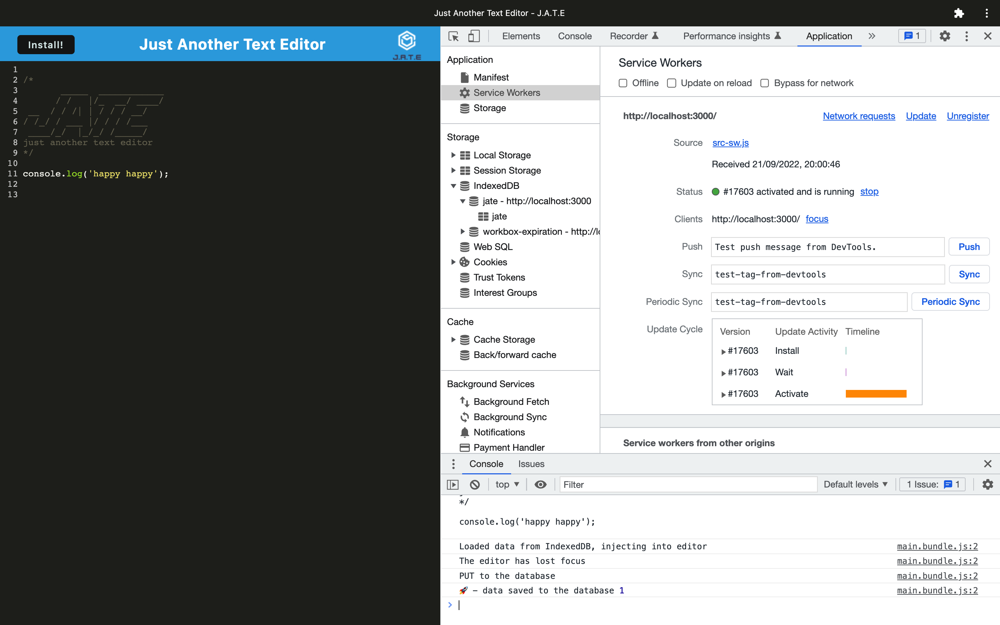

# pwa-text-editor

## Table of Contents

* [Description](#description)
* [Access](#access)
* [Installation](#installation)
* [Usage](#usage)
* [Credits](#credits)

## Description
This project is to build a text editor that meets the pwa requirments. A single page application.


### Tools and Technologies Used

To create this application, I used:
- IndexedDB (via the idb package) as a database
- Webpack to bundle front-end code
- Workbox to create a service worker that caches static assets
- And, Heroku.

### Screenshot of Application



## Access

### Code Repository

Github link 

### Live Application

My application is deployed on Heroku. 

## Installation

To install necessary dependencies, run the following command:

```
npm i
```

## Usage
To use 
run - npm i 
npm build
npm start 


## Credits

- This is the [starter code](https://github.com/coding-boot-camp/cautious-meme) I used.
